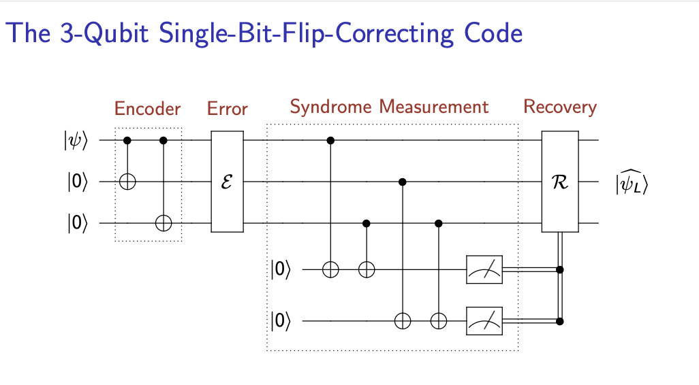
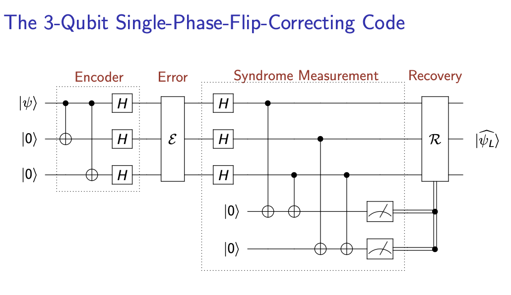

# 🧬 Quantum Error Correction with Qiskit

This repository provides simple yet powerful implementations of quantum error correction (QEC) codes using Qiskit. It demonstrates how we can protect quantum information from noise using:

- ✅ 3-Qubit Bit-Flip Code
- ✅ 3-Qubit Phase-Flip Code
- ✅ 9-Qubit Shor Code

These codes are simulated using randomized noise injection, syndrome measurement, and conditional correction, showcasing how quantum circuits can recover logical qubit states.

---

## 📁 File Structure

| File           | Description                                      |
|----------------|--------------------------------------------------|
| `bit_flip.py`  | Corrects a single bit-flip (X) error using 3-qubit redundancy |
| `phase_flip.py`| Corrects a single phase-flip (Z) error using 3-qubit and Hadamard logic |
| `shor.py`     | Implements Shor’s 9-qubit code for handling both bit-flip and phase-flip errors |

---

## 🔧 Circuit Diagrams

### `bit_flip.py` — 3-Qubit Bit-Flip Code

### `phase_flip.py` — 3-Qubit Phase-Flip Code

### `shore.py` — 9-Qubit Shor Code

---

## 📜 Code Explanation

### `bit_flip.py` — 3-Qubit Bit-Flip Code

This code encodes a qubit into three qubits to protect against a single **bit-flip (X) error**. The basic idea is majority voting: if one of the three bits flips, the remaining two can "outvote" the error.

**Key Steps:**
- Encode the logical qubit: \|ψ⟩ → \|ψ⟩⊗\|ψ⟩⊗\|ψ⟩
- Introduce a random bit-flip (X) on one of the qubits
- Use ancilla qubits to measure the **syndrome**
- Apply correction based on syndrome
- Decode and verify fidelity

The code includes:
- Syndrome decoding using classical bits
- Conditional gates (e.g., `qc.x(qr[1]).c_if(cr, 1)`)
- Fidelity check between original and recovered states

---

### `phase_flip.py` — 3-Qubit Phase-Flip Code

This code corrects **phase-flip (Z) errors**, which are invisible in the computational basis. The solution is to apply **Hadamard gates** before and after the encoding so that phase-flips become bit-flips in a rotated basis.

**Key Steps:**
- Apply Hadamard to convert Z → X
- Encode the state using bit-flip logic
- Apply random phase-flip error
- Measure the syndrome using ancilla qubits
- Correct the qubit based on syndrome
- Decode and apply inverse Hadamards
- Verify correctness

The structure parallels the bit-flip code, but with Hadamard wrappers to handle phase errors.

---

### `shor.py` — 9-Qubit Shor Code

This is a full implementation of the **Shor Code**, capable of correcting both bit-flip and phase-flip errors.

**Key Ideas:**
- Nest 3 phase-flip codes inside 3 bit-flip codes
- Encode a single logical qubit into 9 physical qubits
- Introduce either a bit-flip (X), phase-flip (Z), or both (Y) on a random qubit
- Measure syndromes for both X and Z errors
- Apply appropriate corrections based on the syndrome
- Decode and compare final result

The code is modular and includes:
- Custom functions for encoding, error injection, syndrome decoding, and correction
- Fidelity and state comparison between original and decoded qubits
- Logical verification of success/failure

---

## 📄 License

This project is licensed under the MIT License. You are free to use, modify, and distribute this code with attribution.

---

> Built by **Kavin Uthamaraj**, NIT Raipur  
> For educational purposes and exploration of quantum error correction using Qiskit.
